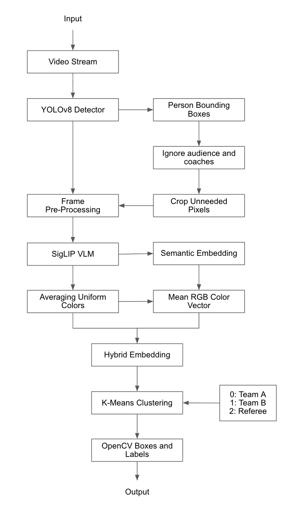

**What's Causing the 15-20% Failure Rate**

The current baseline is only focusing on the average color in the bounding box. This  often causes similarly colored uniforms to be assumed to be a part of the same team. Sunlight or shadows can also alter the color viewed in the footage. In addition, when focusing solely on color, the hardwood court (which is usually tan colored) is included in the average color of the bounding box, which makes different players' average colors even more similar.
 
 

| Feature | CLIP | Florence-2 | Qwen2-VL | SipLIP |
|---------|------|------------|----------|--------|
| Model Approach | Cluster embeddings of players; good at zero-shot classification | Prompt-based; can map images and text to outputs | Prompt-based; multimodal; works for images and videos | Cluster embeddings of players like CLIP; Has sigmoid contrastive loss, which scales better for large batch sizes |
| Inference speed | Very fast | Medium | Slow | Very fast |
| Accuracy | Very good for visual similarity but not very good at OCR | Very good for logos and reading text | Greatest accuracy | Very good for visual similarity |
| Memory | Low | Medium | High | Low |
 

**Recommended Model:**

All four of these VLMs will predict jersey colors significanly better than K-means - even if there are shadows or sunlight - because they use semantic space. If we were to use Florence-2 or Qwen2-VL, we would fail the latency constraint. So we should use the VLM that performs fastest. Both CLIP and SipLIP are extremely fast. However, SipLIP scales better for large batch sizes, so I have decided to use SipLIP.
 
 

**Implementation Strategy**

I will use zero-shot with unsupervised clustering rather than fine-tuning. I decided to not use fine-tuning because it would require thousands of labeled images for every  basketball uniform. With SigLIP, I can use a model that is pre-trained on millions of images.

I will use embedding extraction and clustering instead of direct classification so that the system will work for any teams without needing to know their uniforms or colors beforehand. K-means will group the embeddings without needing pre-defined classes. I am going to use a combination of checking texture (using SigLIP) and checking color to increase the model's accuracy. 

There are several things I will do for batching and optimization. I will filter out the audience members and coaches before running the expensive SigLIP model in order to reduce the amount of inferences per frame. I will also implement the use of GPUs instead of CPUs for SigLIP to decrease runtime. Furthermore, I will reduce input sizes by cropping the head, legs, and a little bit of the sides of players to decrease the amount of irrelevant pixels being processed. This should also lead to more accurate predictions because irrelevant pixels such as the court and players' shoes and skin will not be looked at.

 
 

**Architecture Diagram**

 

**Fallback Strategy**

The fallback strategy will be to use K-Means clustering with uniform colors. In situations where the SigLIP model could struggle (such as blurs from to quick movements that make textures hard to discern), the system will still be able to use the color based K-Means. Although color based K-means is not as "intelligent", it allows the application to still function.

 

**Risk Assessment**

There is a risk that dark team uniforms could result in an average color similar to that of the referees'. My mitigation strategy will be to put more weight into SigLIP to find differences in the texture such as logos or other uniform design components. 

There is also a risk that coaches on the sideline will be detected by YOLOv8 because they are standing on the court. My mitigation strategy will be to check the y-coordiate of the bottom of each person's shoes. If the y-coordinate is above a certain percentage of the screen, the person will be ignored, as they are likely a coach on the sideline.

 

**Success Metrics**

Stability: A player’s team identification should not switch for more than 2 frames.

Accuracy: Manual verification that the predictions are more than 90% correct.

Latency: Less than 100 ms per frame on the H100.

Test Coverage: At least 70% coverage using pytest.
