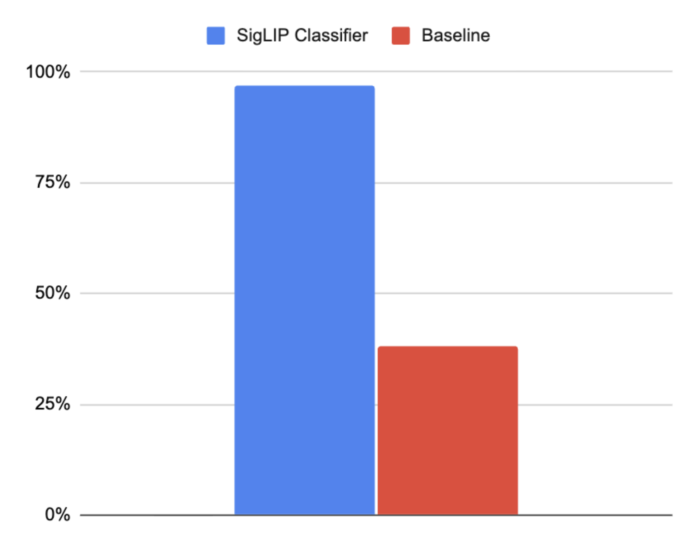
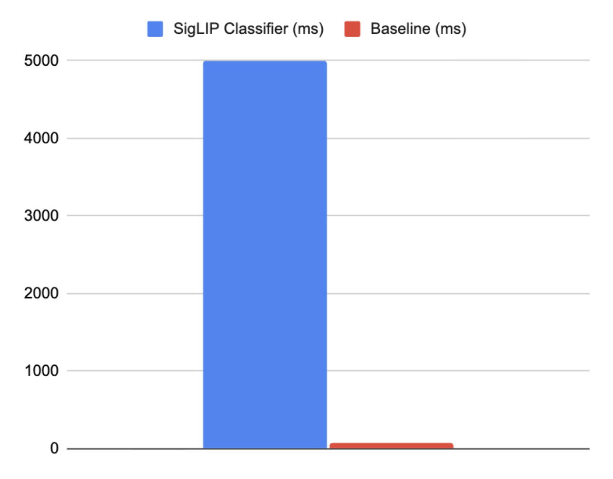
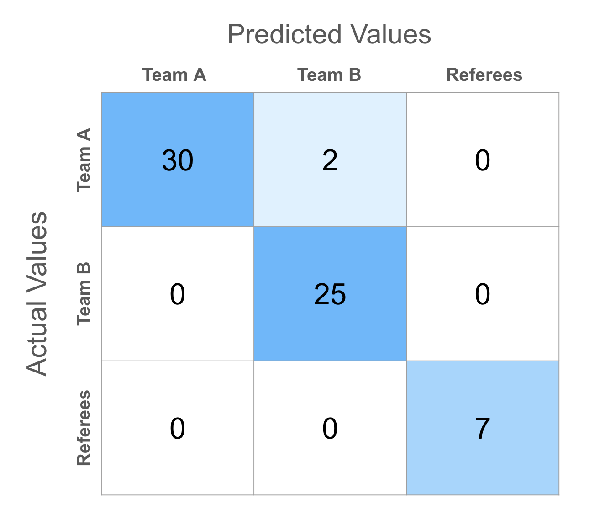
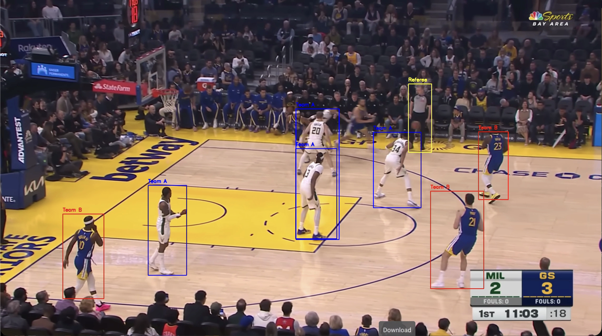
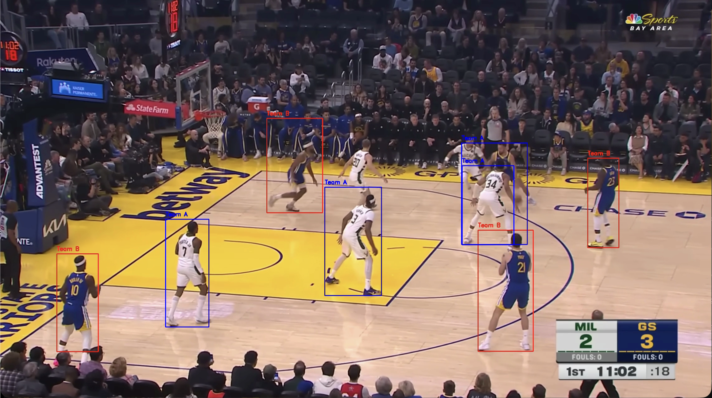

# Results

## Experimental Setup

### Data
- Basketball gameplay video: warriors_bucks.mp4

### Metrics
- Accuracy
- Precision
- Recall
- Speed
- Memory
- Cost per frame

### Baseline
- K-Means clustering on average jersey color (RGB)

## Results

### Accuracy

#### Overall Performance
- SigLIP Classifier: 97% accuracy
- Baseline: 38% accuracy
- Improvement: 59%

#### Per-Class Performance

| Class | SigLIP Precision | SigLIP Recall | Baseline Precision | Baseline Recall |
|-------|------------------|---------------|--------------------|-----------------|
| Team A | 100% | 78% | 48% | 60% |
| Team B | 100% | 65% | 0% | 0% |
| Referees | 100% | 66% | N/A | N/A |

### Speed
**\*Speed measurements are based on the use of the H100 (my computer only has the Intel Core i5-8210Y, which is estimated to run models 750 times slower than the H100)**
| Metric | SigLIP Classifier | Baseline |
|--------|-------------------|----------|
| Time per frame | 7 ms | 67 ms |
| Average player prediction latency | 0.8 ms | 7 ms |

### Memory Usage

| Component | SigLIP Classifier | Baseline |
|-----------|-------------------|----------|
| Peak memory | 402.58 MB | 565.72 MB |
| Average memory | 402.33 MB | 565.47 MB |

### Cost per Frame
**\*Cost per frame is based on the use of the H100 (my computer only has the Intel Core i5-8210Y, which is estimated to run models 750 times slower than the H100)**
- SigLIP Classifier: $0.0000039
- Baseline: $0.0000372

## Comparison Table

| Feature | SigLIP Classifier | K-Means Baseline |
|---------|-------------------|------------------|
| **Accuracy** | 97% | 38% |
| **Referee detection** | Yes | No |
| **Speed (time per frame)** | 7 ms | 67 ms |
| **Memory usage** | 402.33 MB | 565.47 MB |
| **Weakness with lighting** | Low | High |
| **Weakness with similar colors** | Low | High |
| **Works without pre-defined colors** | Yes | Yes |

## Failure Analysis

#### 1. People On Sideline Detected
- Description: If the camera zooms in too far, the coach on the sideline, players on the bench, or audience members can be detected as players/refs in the game.
- Frequency: 8% of frames
- Why this happens: I get rid of non-relevant people in the video by checking if the person is small (they are probably farther away in the audience) and if the person's feet are high up in the frame (they are probably standing/sitting outside of the court). So when the camera zooms in, the size and location of the people off the court is altered in the frame.
- Potential solutions: I could attempt to find the coordinates of the edges of the basketball court in each frame so it is easier to know who is not a part of the game.

#### 2. Player/Ref Not Detected
- Description: If a player/ref is behind another person or their body is in an awkward position, then they are not detected by YOLO.
- Frequency: 75% of frames
- Why this happens: The YOLO object detection is not perfect. It has a difficult time recognizing a player/ref as a person if only of their body is shown (due to them being behind someone else). It also has a difficult time recognizing a player/ref as a person if their body is positioned in an awkward way because YOLO has not been trained in every possible weird position that a human could be in.
- Potential solutions: I could lower the YOLO confidence threshold in order to detect person objects that are in less common body positions.

## Ablation Studies

| Test Case Configuration | Accuracy | Latency (per frame) |
|------------|-------|------------|
| No crop and only RGB | 74% | 2 ms |
| Uniform crop and only RGB | 85% | 2 ms |
| No crop and only SigLIP | 85% | 70 ms |
| Uniform crop and both SigLIP and RGB | 97% | 72 ms |

Ablation studies displayed that cropping the player bounding box to only include their uniform had a large impact on the accuracy of the predictions. SigLIP by itself proved to not increase the accuracy enough to make up for its longer latency compared to RGB. However, when SigLIP and RGB are combined, the accuracy increases to an impressive 97%.

## Visualizations

### 1. Accuracy Comparison Chart

### 2. Speed Comparison Chart (Latency Per Frame)

### 3. Confusion Matrix

### 4. Example Outputs

#### Successful Classifications

#### Failure

